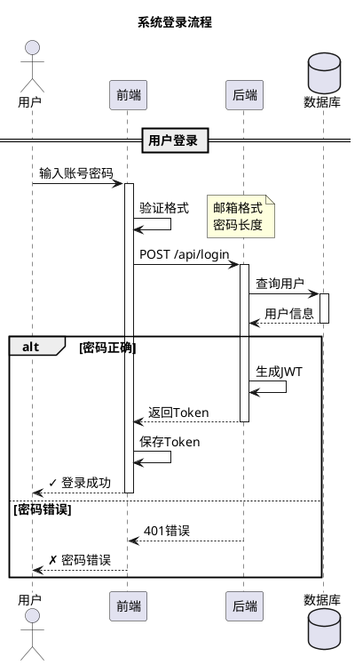

# PlantUML在线查看方法

## 方法1：PlantUML官方在线编辑器

1. 访问：https://www.plantuml.com/plantuml/uml/
2. 复制下面的代码
3. 粘贴到编辑器
4. 自动生成图片

## 系统登录流程图代码

## 方法2：VS Code + PlantUML插件

1. 安装VS Code
2. 安装PlantUML插件
3. 创建`.puml`文件
4. 按`Alt+D`预览

## 方法3：在线渲染服务

使用PlantUML服务器：
- 官方：http://www.plantuml.com/plantuml/uml/
- 备用：https://plantuml.com/zh/

## 当前问题

本地Python编码方法有误，PlantUML服务器无法识别。
建议直接使用在线编辑器查看。

---

*创建时间：2026-03-02 23:20*
