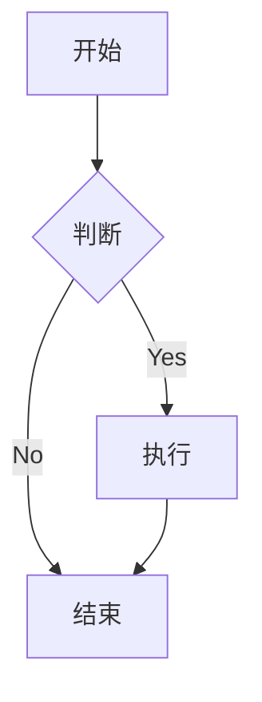
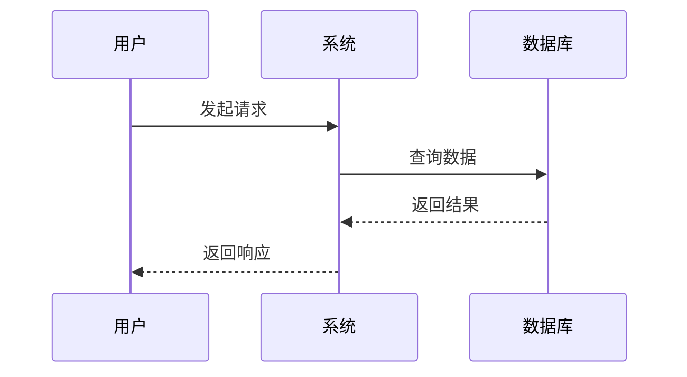
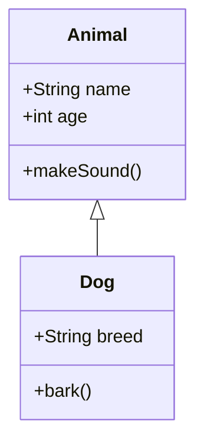
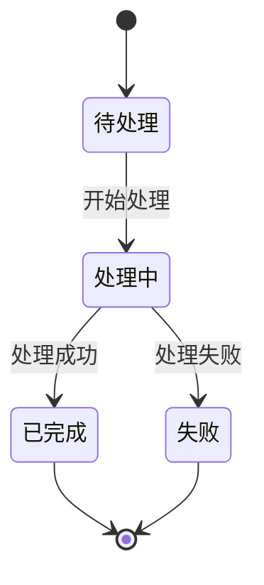
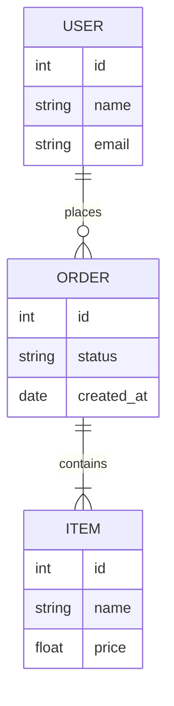
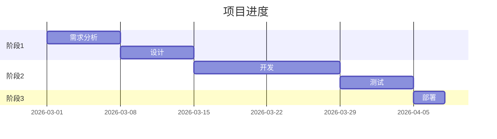
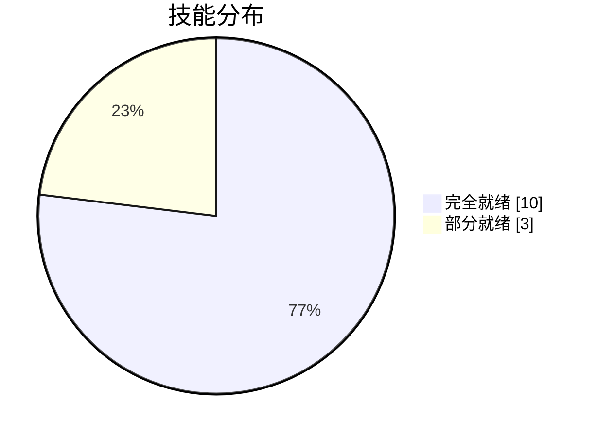
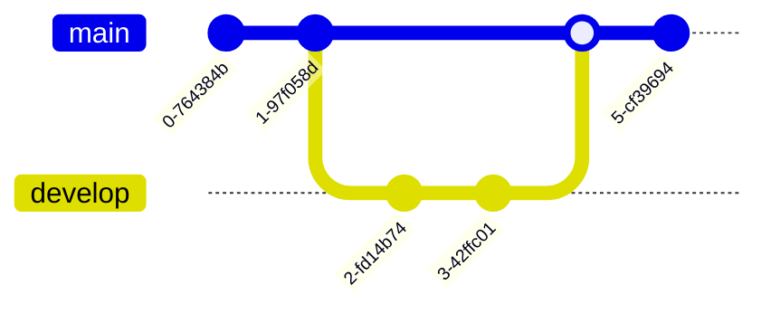

# Mermaid 结构图生成技能使用指南

## ✅ 安装状态

**安装时间**：2026-03-09 22:32
**工具名称**：Mermaid CLI
**版本**：@mermaid-js/mermaid-cli
**安装位置**：全局 npm 包

---

## 🚀 使用方式

### **1. 基础命令**

```bash
# 生成 PNG
mmdc -i input.mmd -o output.png

# 生成 SVG
mmdc -i input.mmd -o output.svg

# 生成 PDF
mmdc -i input.mmd -o output.pdf

# 指定背景色
mmdc -i input.mmd -o output.png -b white

# 指定主题
mmdc -i input.mmd -o output.png -t dark
```

---

## 📊 支持的图表类型

### **1. 流程图（Flowchart）**



**语法**：
```bash
cat > /tmp/flowchart.mmd << 'EOF'
graph TD
    A[开始] --> B{判断}
    B -->|Yes| C[执行]
    B -->|No| D[结束]
    C --> D
EOF

mmdc -i /tmp/flowchart.mmd -o /tmp/flowchart.png
```

---

### **2. 时序图（Sequence Diagram）**



**语法**：
```bash
cat > /tmp/sequence.mmd << 'EOF'
sequenceDiagram
    participant 用户
    participant 系统
    participant 数据库
    
    用户->>系统: 发起请求
    系统->>数据库: 查询数据
    数据库-->>系统: 返回结果
    系统-->>用户: 返回响应
EOF

mmdc -i /tmp/sequence.mmd -o /tmp/sequence.png
```

---

### **3. 类图（Class Diagram）**



**语法**：
```bash
cat > /tmp/class.mmd << 'EOF'
classDiagram
    class Animal {
        +String name
        +int age
        +makeSound()
    }
    
    class Dog {
        +String breed
        +bark()
    }
    
    Animal <|-- Dog
EOF

mmdc -i /tmp/class.mmd -o /tmp/class.png
```

---

### **4. 状态图（State Diagram）**



**语法**：
```bash
cat > /tmp/state.mmd << 'EOF'
stateDiagram-v2
    [*] --> 待处理
    待处理 --> 处理中: 开始处理
    处理中 --> 已完成: 处理成功
    处理中 --> 失败: 处理失败
    已完成 --> [*]
    失败 --> [*]
EOF

mmdc -i /tmp/state.mmd -o /tmp/state.png
```

---

### **5. ER 图（Entity Relationship）**



**语法**：
```bash
cat > /tmp/er.mmd << 'EOF'
erDiagram
    USER ||--o{ ORDER : places
    ORDER ||--|{ ITEM : contains
    USER {
        int id
        string name
        string email
    }
    ORDER {
        int id
        string status
        date created_at
    }
    ITEM {
        int id
        string name
        float price
    }
EOF

mmdc -i /tmp/er.mmd -o /tmp/er.png
```

---

### **6. 甘特图（Gantt）**



**语法**：
```bash
cat > /tmp/gantt.mmd << 'EOF'
gantt
    title 项目进度
    dateFormat YYYY-MM-DD
    section 阶段1
    需求分析: 2026-03-01, 7d
    设计: 2026-03-08, 7d
    section 阶段2
    开发: 2026-03-15, 14d
    测试: 2026-03-29, 7d
    section 阶段3
    部署: 2026-04-05, 3d
EOF

mmdc -i /tmp/gantt.mmd -o /tmp/gantt.png
```

---

### **7. 饼图（Pie Chart）**



**语法**：
```bash
cat > /tmp/pie.mmd << 'EOF'
pie showData
    title 技能分布
    "完全就绪" : 10
    "部分就绪" : 3
EOF

mmdc -i /tmp/pie.mmd -o /tmp/pie.png
```

---

### **8. Git 图（Git Graph）**



**语法**：
```bash
cat > /tmp/git.mmd << 'EOF'
gitGraph
    commit
    commit
    branch develop
    checkout develop
    commit
    commit
    checkout main
    merge develop
    commit
EOF

mmdc -i /tmp/git.mmd -o /tmp/git.png
```

---

## 🎯 实际用例

### **用例1：系统架构图**

```bash
cat > /tmp/architecture.mmd << 'EOF'
graph TB
    subgraph 前端
        A[Web App]
        B[Mobile App]
    end
    
    subgraph 后端
        C[API Gateway]
        D[Auth Service]
        E[Business Logic]
    end
    
    subgraph 数据层
        F[(PostgreSQL)]
        G[(Redis)]
        H[(MongoDB)]
    end
    
    A --> C
    B --> C
    C --> D
    C --> E
    D --> F
    E --> F
    E --> G
    E --> H
EOF

mmdc -i /tmp/architecture.mmd -o /tmp/architecture.png -b white -w 2048
```

---

### **用例2：用户流程图**

```bash
cat > /tmp/user-flow.mmd << 'EOF'
graph TD
    Start[用户访问] --> Login{已登录?}
    Login -->|No| Register[注册]
    Register --> Login
    Login -->|Yes| Home[首页]
    Home --> Search[搜索]
    Search --> Detail{找到?}
    Detail -->|Yes| View[查看详情]
    Detail -->|No| Search
    View --> Purchase{购买?}
    Purchase -->|Yes| Payment[支付]
    Purchase -->|No| Home
    Payment --> Success[成功]
    Success --> Home
EOF

mmdc -i /tmp/user-flow.mmd -o /tmp/user-flow.png -b white
```

---

### **用例3：数据流程图**

```bash
cat > /tmp/data-flow.mmd << 'EOF'
sequenceDiagram
    participant U as 用户
    participant A as 前端
    participant B as API
    participant D as 数据库
    participant C as 缓存
    
    U->>A: 提交表单
    A->>B: POST /api/data
    B->>C: 检查缓存
    C-->>B: 缓存未命中
    B->>D: 查询数据
    D-->>B: 返回数据
    B->>C: 更新缓存
    B-->>A: 返回结果
    A-->>U: 显示结果
EOF

mmdc -i /tmp/data-flow.mmd -o /tmp/data-flow.png -b white
```

---

## 📋 常用参数

| 参数 | 说明 | 示例 |
|------|------|------|
| `-i` | 输入文件 | `-i diagram.mmd` |
| `-o` | 输出文件 | `-o diagram.png` |
| `-b` | 背景色 | `-b white` |
| `-t` | 主题 | `-t dark` |
| `-w` | 宽度 | `-w 2048` |
| `-H` | 高度 | `-H 1024` |
| `-e` | 输出格式 | `-e png` |

---

## 🎨 主题选择

**内置主题**：
- `default` - 默认主题
- `dark` - 深色主题
- `forest` - 森林主题
- `neutral` - 中性主题
- `base` - 基础主题

**使用方式**：
```bash
mmdc -i diagram.mmd -o diagram.png -t dark
```

---

## ⚠️ 注意事项

1. **文件格式**：
   - 输入文件扩展名：`.mmd` 或 `.mermaid`
   - 输出格式：PNG、SVG、PDF

2. **中文支持**：
   - Mermaid 默认支持 UTF-8
   - 确保输入文件使用 UTF-8 编码

3. **文件大小**：
   - 简单图表：~50KB
   - 复杂图表：~200KB

4. **性能**：
   - 简单图表：<1秒
   - 复杂图表：2-3秒

---

## 🔧 常用命令

```bash
# 查看版本
mmdc --version

# 查看帮助
mmdc --help

# 批量生成
for file in *.mmd; do
    mmdc -i "$file" -o "${file%.mmd}.png"
done
```

---

## 📊 图表类型对比

| 图表类型 | 适用场景 | 复杂度 |
|---------|---------|--------|
| **流程图** | 业务流程、决策树 | ⭐⭐ |
| **时序图** | 系统交互、API 调用 | ⭐⭐ |
| **类图** | 软件架构、继承关系 | ⭐⭐⭐ |
| **状态图** | 状态机、生命周期 | ⭐⭐⭐ |
| **ER 图** | 数据库设计 | ⭐⭐⭐ |
| **甘特图** | 项目进度 | ⭐⭐ |
| **饼图** | 数据占比 | ⭐ |
| **Git 图** | 分支管理 | ⭐⭐ |

---

**官家，Mermaid 结构图生成技能已安装完成！** 🌾

**支持 8 种图表类型**：流程图、时序图、类图、状态图、ER 图、甘特图、饼图、Git 图
